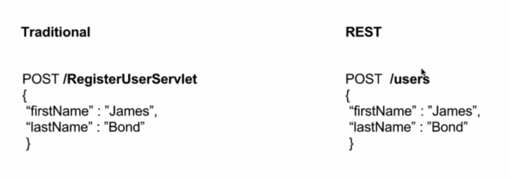
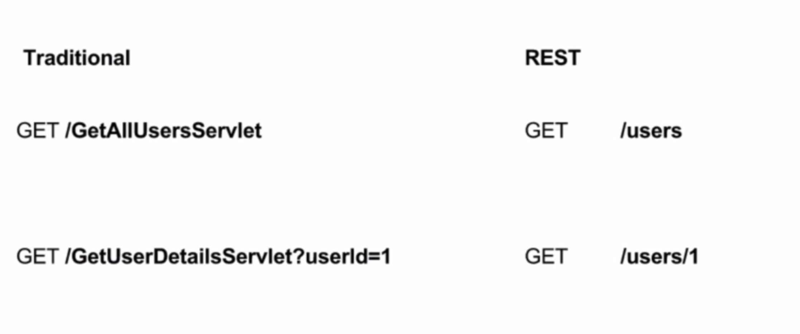
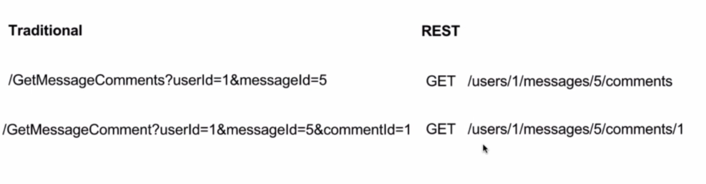
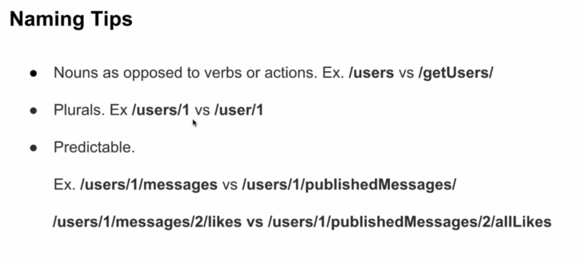

# REST vs RPC

### RPC PROS and CONS

|PROS|CONS|
|----|----|
|Simple and easy to understand|Tight coupling|
|Lightweight payloads|No discoverablity|
|High performance|Function explosion|

    

    

    

    

